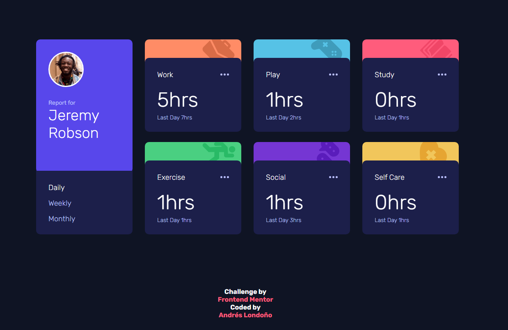
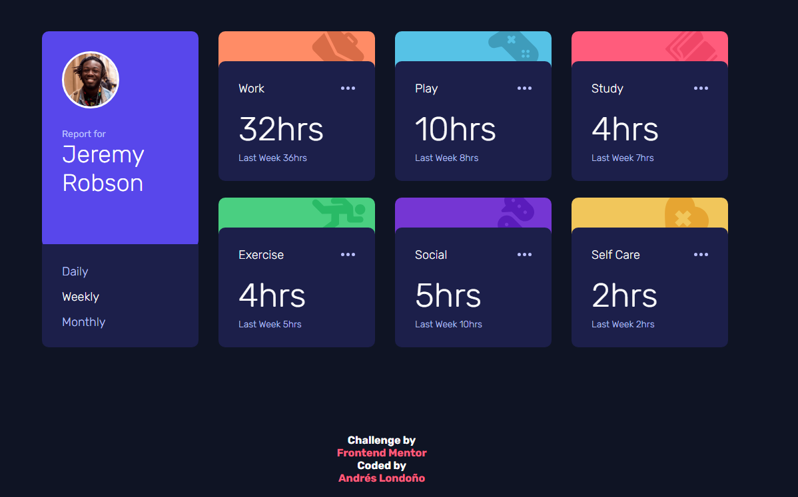
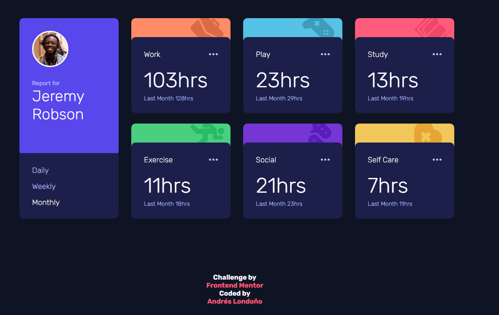
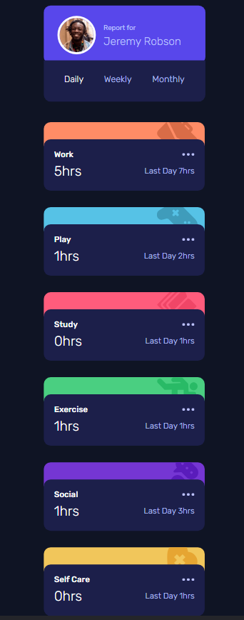
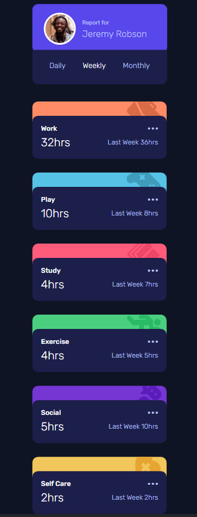
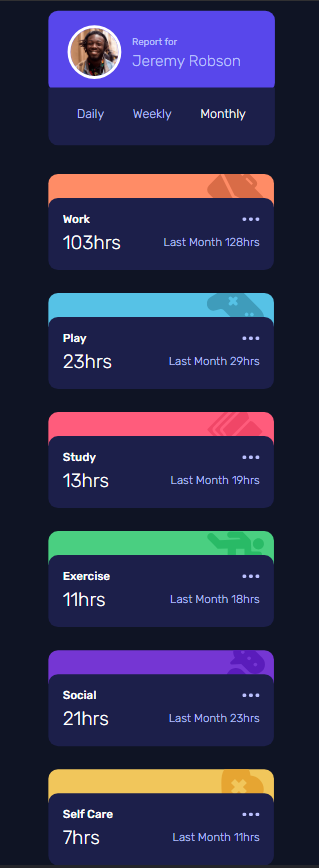

# Frontend Mentor - Time tracking dashboard solution

This is a solution to the [Time tracking dashboard challenge on Frontend Mentor](https://www.frontendmentor.io/challenges/time-tracking-dashboard-UIQ7167Jw). Frontend Mentor challenges help you improve your coding skills by building realistic projects. 

## Table of contents

- [Frontend Mentor - Time tracking dashboard solution](#frontend-mentor---time-tracking-dashboard-solution)
  - [Table of contents](#table-of-contents)
  - [Overview](#overview)
    - [The challenge](#the-challenge)
    - [Screenshot](#screenshot)
  - [Desktop](#desktop)
  - [Mobile](#mobile)
    - [Links](#links)
  - [My process](#my-process)
    - [Built with](#built-with)
    - [What I learned](#what-i-learned)
  - [Author](#author)

## Overview

### The challenge

Users should be able to:

- View the optimal layout for the site depending on their device's screen size
- See hover states for all interactive elements on the page
- Switch between viewing Daily, Weekly, and Monthly stats

### Screenshot

## Desktop

- Daily

  

- Weekly
  
  

- Monthly
  
  

## Mobile

- Daily

  

- Weekly
  
  

- Monthly
  
  

### Links

- Solution URL: [Github](https://github.com/andreslondono00/time-tracking-dashboard)

## My process

### Built with

- Semantic HTML5 markup
- CSS custom properties
- Flexbox
- CSS Grid
- JavaScript

### What I learned

I learned that when I click on an option (day, week, month), one of them remains active and the other two disappear, and also that when the page starts, the day option remains active.


```js
    document.getElementById("daily_menu").classList.add("active");
    document.getElementById("weekly_menu").classList.remove("active");
    document.getElementById("monthly_menu").classList.remove("active");
```
```js
    onDailyClick();
```

## Author

- Frontend Mentor - [@andreslondono00](https://www.frontendmentor.io/profile/andreslondono00)

